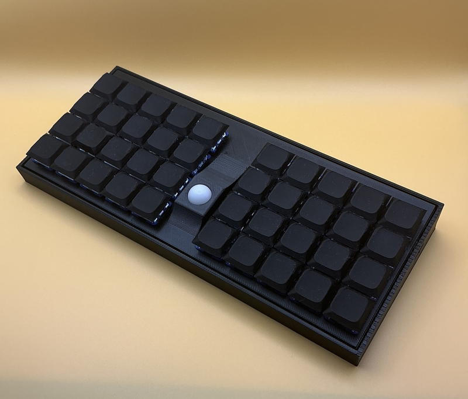
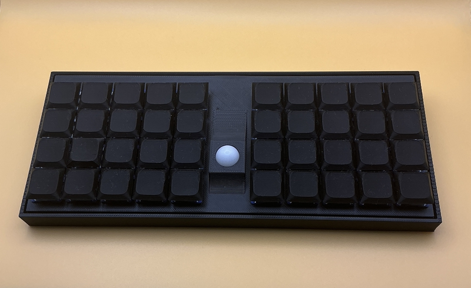

# cool640tb

## What is cool640tb?

cool640tb is ortholiner keyboard with trackball.

 
cool640tb use seeed xiao ble,run zmk_firmware.
 
 

作った理由
 
https://sizu.me/m_ki/posts/i3df5xan90us
 

## firmware

[zmk-config](https://github.com/telzo2000/zmk-config-cool640tb)

 
keymap editor

https://nickcoutsos.github.io/keymap-editor/

 
zmk studio

https://zmk.studio/

 

自作キーボードへのzmk_firmwareのインストールについて

https://sizu.me/m_ki/posts/kvixkn2mec6a

 
zmk_firmwareでのキーマップ編集について

https://sizu.me/m_ki/posts/m3devs7be5km

 

## buildguide

https://github.com/telzo2000/cool640tb/blob/main/buildguide_for_cool640tb.md

 
組み立てたけど、キーが反応しない時は
 
https://sizu.me/m_ki/posts/3vcc3izdt1w4
 

 

## BOM
<b>common parts</b>
| No. | Patrs | Quantity | remarks | Suppliers | Cost |
|--|--|--|--|--|--|
|番号|名前|数|備考|調達先|参考価格（送料込）| 
|1|PCB|1||[elecrow](https://www.elecrow.com) [JLCPCB](https://jlcpcb.com) [ALLPCB](https://www.allpcb.com)|| 
|2|Top case|1|3D Print|||
|3|Bottom case|1|3D Print|||
|4|Switch knob|1|3D Print|||
|5|Slide switch スライドスイッチ|1||[秋月電子](https://akizukidenshi.com/catalog/g/g115370/)|１個30円|
|6|AAAA Battery case 単４電池ケース|2||[秋月電子](https://akizukidenshi.com/catalog/g/g102670/)|１個40円|
|7|XIAO nRF52840 Plus|1|MCU Board|[seeed studio](https://www.seeedstudio.com/Seeed-Studio-XIAO-nRF52840-Plus-p-6359.html) [スイッチサイエンス](https://www.switch-science.com/products/10468?srsltid=AfmBOop922ZEHWC7FqFZZKFmG-2YqUAAqYu5usYdPweG1f1-7KqjcMUV)|2139円|
|8|Diode ダイオード|40|SMD|[遊舎工房](https://yushakobo.jp) [Talp Keyboard](https://talpkeyboard.net) [Daily Craft Keyboard](https://shop.dailycraft.jp)等|100個で220円程度から|
|9|Switch socket スイッチソケット|40|choc|[遊舎工房](https://yushakobo.jp) [Talp Keyboard](https://talpkeyboard.net) [Daily Craft Keyboard](https://shop.dailycraft.jp)等|10個で165円程度|
|10|Screw ネジ|2|スリムヘッドM2 3mm|[遊舎工房](https://shop.yushakobo.jp/products/a0800s3)|50本550円(遊舎工房)|
|11|Screw ネジ|2|M2 4mm|DIY shop|10本200円程度|
|12|Spacer スペーサー|2|M2 6mm|DIY shop|10本400円程度|
|13|Keyswitch キースイッチ|40|chocV1及びV2対応|[遊舎工房](https://yushakobo.jp) [Talp Keyboard](https://talpkeyboard.net) [Daily Craft Keyboard](https://shop.dailycraft.jp)|１個100程度|
|14|Keycap キーキャップ|40|16.8mm以下の狭ピッチ、ロープロが最適|3D Print||
|15|ball ボール|1|12mm球|[アリエク](https://ja.aliexpress.com/item/1005004971601859.html?spm=a2g0o.order_list.order_list_main.40.1af1585acsTIVI&gatewayAdapt=glo2jpn)|50個で500円ぐらい|
|16|PMW3610|1|Trackball senser|[アリエク](https://ja.aliexpress.com/item/1005007622547772.html?spm=a2g0o.order_list.order_list_main.45.72e8585aVqU7cH&gatewayAdapt=glo2jpn)|1000円ぐらい|
|17|リセットスイッチ（タクトスイッチ）|1||[秋月電子](https://akizukidenshi.com/catalog/g/g108073/)|１個20円|
|18|センサー基板|1|PWM3610に使用する。７ピンのピンヘッダまたはコンスルーが必要||[Data](https://github.com/telzo2000/cool942tb/tree/main/gbr/PWM3610/gbr)|

In addition, NiHM rechargeable batteries (4 AAA size), USB cable, etc. are required.
 
この他に、NiHM充電池（単４形2本）、USBケーブル等が必要です。
 
狭ピッチのキーキャップについては、次のサイトを利用して作成し、3Dプリンタで印刷しました。

[Maker World](https://makerworld.com/ja/makerlab/parametricModelMaker?designId=1378891&exp=1746523152&from=model_page&key=d50b80e9ac74e47d2eedbaa7d961abea&modelName=keycap_generator_rev.scad&scadUrl=https%3A%2F%2Fmakerworld.bblmw.com%2Fmakerworld%2Fmodel%2FUS196180b5aa4a8f%2Fmsfile%2F2025-05-06_a1b411b65c3a.scad%3Fat%3D1746522852&uid=432320066&unikey=127d3f10-1090-486f-b41f-f75099af80c4)

# license

[CC BY-NC-SA](https://creativecommons.org/licenses/by-nc-sa/4.0/deed.ja)

