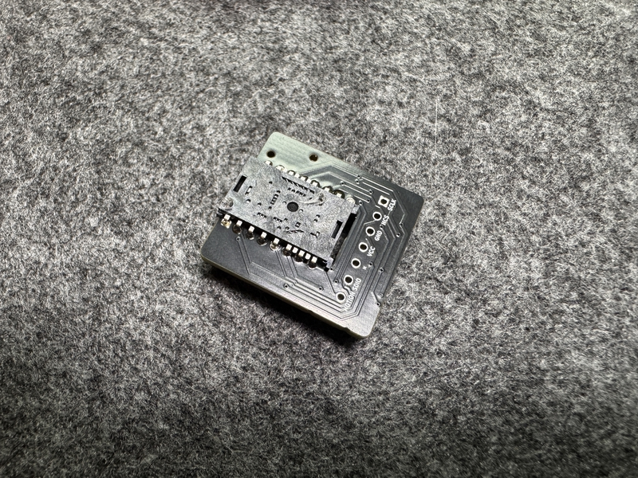
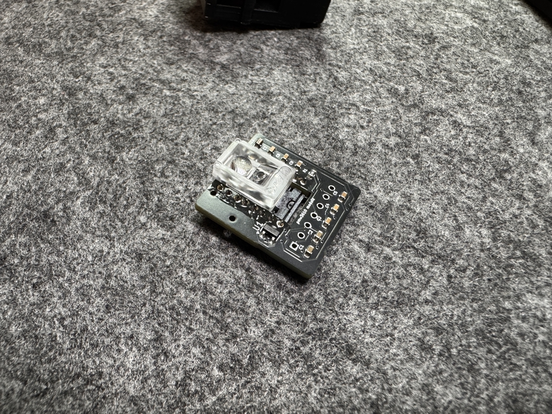
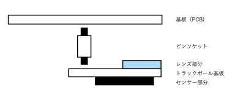
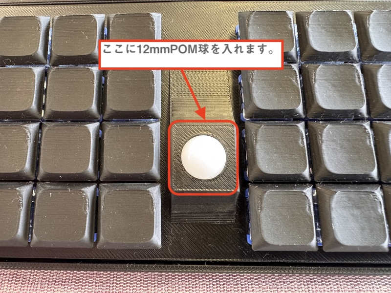
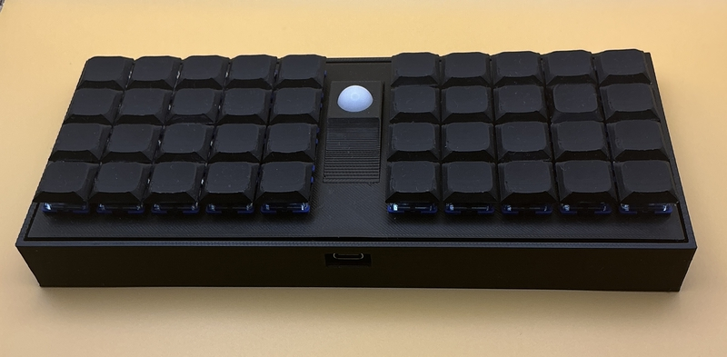

 　# Buildguide for cool640tb
 

## 0 部品の確認
 
Follow the BOM on github's readme.md to make sure that all the parts are available.
 
githubのreadme.mdのBOMに沿って、部品が全て揃っているかを確認してください。
 

## 1 ダイオードのはんだ付け

If the diode is already soldered, please skip this operation.
 
すでにダイオードのはんだ付けされている場合は、この作業を省略してください。
 
 
This work is done on the left and right keyboard boards respectively.
 
この作業は左右のキーボード基板でそれぞれ行います。
  
Solder the diodes to the back of PCB.
 
PCBの裏面にダイオードのハンダ付けをします。
 
As expected, it is compatible with SMD type.
 
ダイオードは、SMDタイプに対応しています。
 
Diodes have polarity, so be careful about the direction in which they are installed.
 
ダイオードには極性がありますので、取り付ける向きに注意してください。
 

[ダイオード（SMD)のはんだ付けの動画](https://youtu.be/ODk16bd4XkA)
 
[ダイオード（リードタイプ）のはんだ付けの動画](https://youtu.be/lbAQkKzNawM)
 
[ダイオード（リードタイプ）のはんだ付けの動画２](https://youtu.be/3hWZjaBROL8)

 

## 2  スイッチソケットのハンダ付け

cool640tb supports choc switch sockets.
 
cool640tbでは、chocのスイッチソケットに対応しています。
  
Solder the switch socket to the back of the keyboard board.
 
キーボード基板の裏面にスイッチソケットのハンダ付けをします。
 

[Switch socketハンダ付け動画](https://youtu.be/ZnbgaueMR4w?si=_JLjD--3HJJ5Pu7Q)

 

## 3 Seeed xiao ble Plus(xiao nRF 52840 Plus)のハンダ付け

<b>Note</b>
 
次の動画を参考にしてハンダ付けをしてください。
 
[xiao ble Plusのハンダ付け動画](https://youtu.be/T4O7NxNUMdo)

## 4  電池ボックス取り付け

Insert the battery box from the bottom of the board and temporarily fix it in place with masking tape. Then, cut off the leads sticking out from the top of the board with pliers or something similar, and solder them.
 
電池ボックスを基板の下面から、差し込み、マスキングテープで仮固定します。そして、基板の上面から飛び出したリードをニッパーなどで切り取り、ハンダ付けをしてください。
 

## 5 スライドスイッチのハンダ付け

Insert the switch from the underside of the PCB with the tab facing outwards.
 
スイッチのつまみが外側に向くようにして、PCBの下面から差し込みます。
 
Temporarily fix it in place with masking tape or something similar, then cut off the part sticking out on the top surface of the PCB with pliers, and then solder it.
 
マスキングテープなどで仮固定をしてから、PCBの上面に出た部分をニッパーで切り取ってから、はんだ付けします。
 

[スライドスイッチのはんだ付けの作業動画](https://youtu.be/5nkRklibay4)

 

## 6 リセットスイッチのハンダ付け

The switch button faces down and is inserted into the underside of the PCB.
 
スイッチのボタンが下に向くようにして、 PCBの下面から差し込みます。
 
Temporarily fix it in place with masking tape or something similar, then cut off the part sticking out on the top surface of the PCB with pliers, and then solder it.
 
マスキングテープなどで仮固定をしてから、PCBの上面に出た部分をニッパーで切り取ってから、はんだ付けします。

[リセットスイッチハンダ付け動画](https://youtu.be/Pl24Exfh8b8)

## 7 トラックボール基板の作成

Caution PMW3610 is prone to sensor damage when exposed to high temperature heat. Please complete the soldering of each pin in a short time.
 
注意　PMW3610は高温の熱にさらされるとセンサーの破損が発生しやすいです。それぞれのピンのはんだ付けは短時間で済ませてください。
 
As for my example, soldering is processed in 2-3 seconds per pin.
 
私の例ですが、はんだ付けを１つのピンにつき、2〜3秒で処理します。
 
 
Note: The silk of "Front side" and "Back side" on the board is written for the ball.
 
注意　基板に「Front side」や「Back side」のシルクは、ボールに対しての表記です。
 
 
The trackball board has components installed from the beginning. The implemented side is the back side.
 
トラックボール基板は最初から部品が実装されています。実装されている面を裏面とします。
 
 
Remove the PWM3610 acrylic parts.
 
PWM3610アクリル部品を取り外します。
 
 
Check the pin of the PMW3610 and insert it from the surface of the trackball board. Temporarily fix it with masking tape.
 
PMW3610のピンを確認して、トラックボール基板の表面から差し込みます。マスキングテープで仮固定します。

 
 
The back of the trackball board is facing up and the part that came out of the pin hole is soldered.
 
トラックボール基板の裏面を上向きにして、ピン穴からでた部分をはんだ付けします。
 
 
The lens part of the PMW3610 is covered with tape, so remove it.
 
PMW3610のレンズ部分がテープで覆われているので、それを外します。
 
 
From the back of the trackball board, cover the acrylic part on the PMW3610, and melt the acrylic on the back with a soldering ick to prevent it from coming off.
 
トラックボール基板の裏面の方から、アクリル部品をPMW3610に被せて、その裏側に出たアクリルをハンダごてで溶かして外れないようにします。

 
 

## 8 センサー基板のはんだ付け

The sensor board created in step 7 is fixed to the circuit board by soldering it with the pin head in between.
 
7で作成したセンサー基板を基板にピンヘッドを間に挟んではんだ付けして固定します。
 

Please refer to the diagram above when soldering. When doing so, use pliers or similar to cut off any protruding pin heads.
 
上の図を参考にして、はんだ付けをしてください。その際、はみ出たピンヘッドはニッパーなどで切り取ってください。
 

## 9 スペーサーの装着

Insert the M2 3mm screw from the top of the board and secure it with the M2 6mm spacer from the bottom of the board.
 
基板の上面から、M2 3mmネジを挿入して、基板の下面からM2 6mmスペーサーで固定してください。
 
This is done in four places.
 
これは４箇所行います。
 

## 10　キースイッチの装着

Insert the key switch in the following order: top case, then PCB.
 
トップケース、PCBの順になるように、キースイッチを差し込んでください。
 
When inserting the key switch, make sure the pins are straight.
 
キースイッチを差し込む時、キースイッチのピンが真っ直ぐになっているか、確認してください。
 

## 11 トラックボールの装着

Place the 12mm POM ball in the designated location on the top case.
 
12mmPOM球をトップケースの所定の位置に装着してください。
 

## 12 動作確認について

ファームウェアの導入について、こちらの記事を参考にしてください。
 
[自作キーボードへのzmk_firmwareのインストールについて](https://sizu.me/m_ki/posts/kvixkn2mec6a)

 
Keymapの編集について、こちらの記事を参考にしてください。

[zmk_firmwareでのキーマップ編集について](https://sizu.me/m_ki/posts/m3devs7be5km)

## 9 ボトムケースの装着

動画を参考にしてください。

[ケースの開閉について](https://www.youtube.com/watch?v=Rq6qG2JvAKY)

##  10　キーキャップの装着

Please attach your favorite keycap.
 
お好きなキーキャップを装着してください。
 

## 11 完成

After attaching non-slip rubber to the bottom of the bottom case, it's done.
 
Please enjoy a life with a better keyboard.
 
ボトムケースの底面に、滑り止めゴムを取り付けたら、完成です。
 
よりよいキーボードのある生活を楽しんでください。
 

